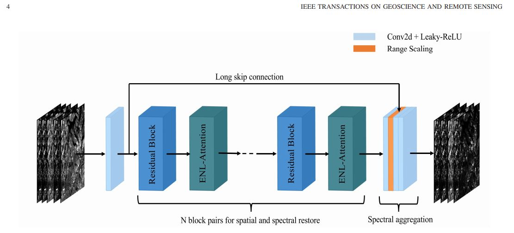
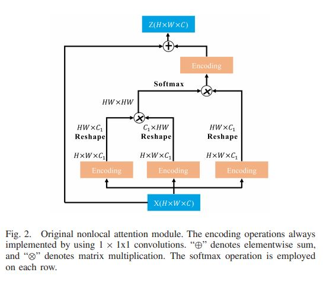
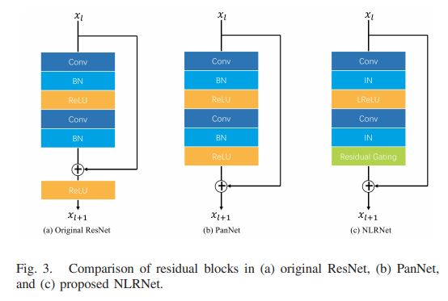
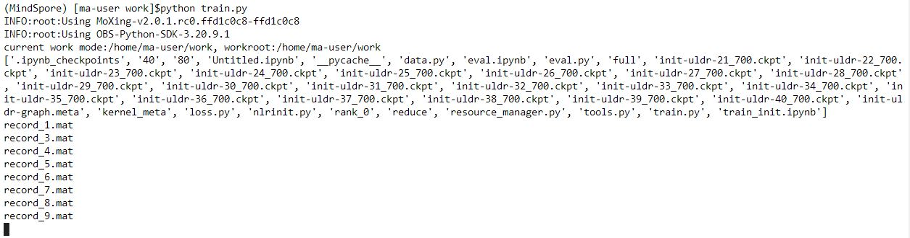
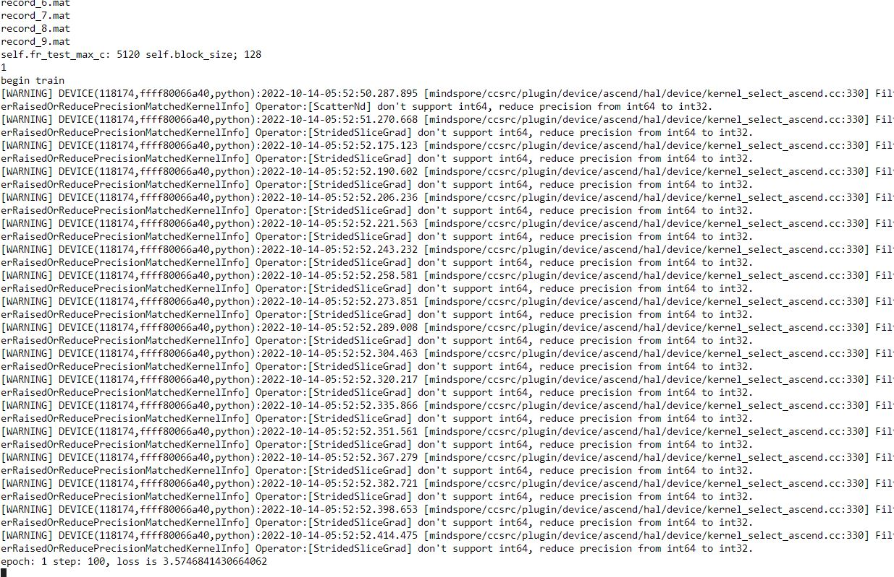
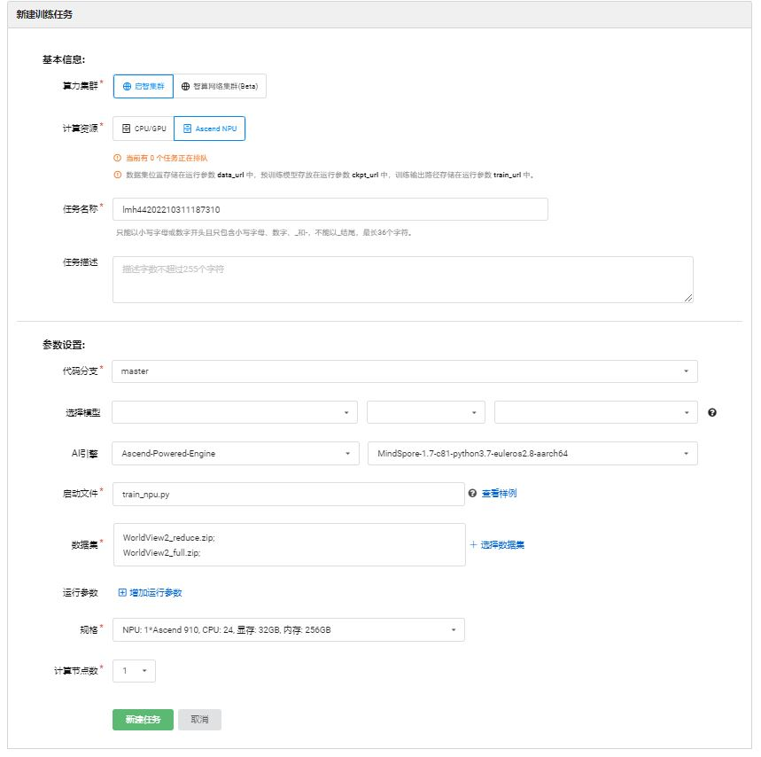
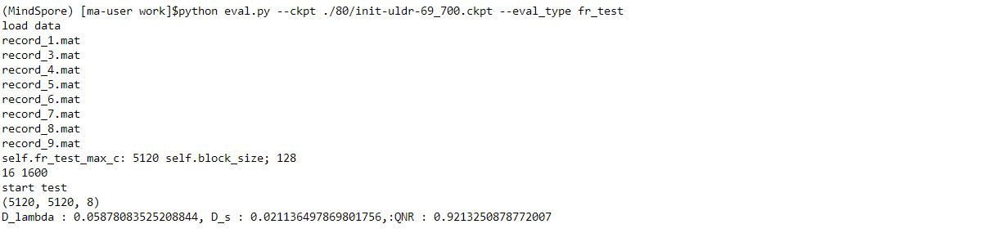
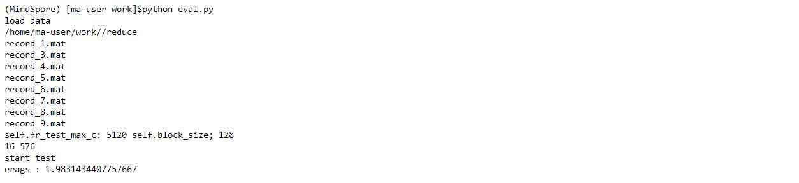

# 目录
<!-- TOC -->

- [目录](#目录)
    - [模型简介](#模型简介)
        - [网络模型结构](#网络模型结构)
    - [数据集](#数据集)
    - [环境要求](#ENV)
    - [快速开始](#Start)
    - [脚本及样例代码](#Code)
    - [脚本参数](#param)
    - [评估](#eval)
    - [评估过程](#evalusage)
    - [评估结果](#evalresult)
<!-- /TOC -->
# [模型简介](#目录)
遥感图像往往包含许多相似的成分，如建筑物、道路、水面等，它们具有相似的光谱和空间结构。虽然基于残差学习的卷积神经网络(CNNs)可以在泛锐化中提供良好的性能，但现有的方法并没有充分利用图像中的内在相似信息。此外，由于卷积运算集中在局部区域，即使在深度网络中，也很难获得位置无关的全局信息。文章提出了一种高效的非局部注意残差网络(NLRNet)来捕获所有像素的相似上下文依赖性。具体而言，为了降低原有的非局部注意给网络训练带来的困难，我们提出了一种高效的非局部注意(ENLA)机制，并利用残差零初始化(ReZero)技术使信号易于在网络中传播。此外，提出了一种光谱聚合模块(SpecAM)来生成融合图像并调整相应的光谱信息。

-网络模型结构：

如图展示了NLRNet的网络结构，该网络由两部分组成:使用交替堆叠的残差模块和非局部注意模块重构光谱和空间信息，使用SpecAM生成融合图像并调整其光谱信息。交替叠加结构允许梯度有更多的传播路径。


 
此外，所有剩余模块和非本地注意模块都有一个剩余门控单元，并且都初始化为零，这意味着网络的初始状态不包含任何剩余和注意模块。通过数据驱动学习，网络可以动态选择每个模块的输出状态。

# [数据集](#数据集)
Openl 开源wordview2 数据集，提供World-View 2 卫星数据。(https://git.openi.org.cn/deng/WordView-2/datasets)
1.3代码提交地址：
https://git.openi.org.cn/lmh447669785/NLR/src/branch/master/

本地数据集请存放如下格式
```bash
├── data
└─ reduce             # 
    ├── reduce_1.mat					//数据集
    ...
    ├── reduce_9.mat					//数据集
└─ full            # 
    ├── full6.mat					//数据集
```
# [环境要求](#环境要求)
镜像 Ascend-Powered-Engine | mindspore_1.7.0-cann_5.1.0-py_3.7-euler_2.8.3-aarch64
规格	Ascend: 1*Ascend910|CPU: 24核 96GB
# [脚本及样例代码](#Code)
 ```bash
├── code

    ├── eval.py				//验证脚本  
    ├── train.py               //启智多卡训练脚本  
    ├── train_npu.py				//启智平台训练脚本
    ├── main.py					//本地训练脚本   						
    └─ src             # 辅助脚本
        ├── data.py					//数据集
        ├── nlrinit.py		//模型
        ├── resource_manager.py  //数据集预处理
        ├── tools.py
        ├── loss.py               		//损失函数
    └─ scripts
        ├─run_eval.sh
        ├─run_single_train.sh 
├── README.md   //README 
```


# [脚本参数](#param)
batch_size = 16
epoch =80
learning rate = 0.0005
optimizer = nn.Adam
Loss = 空间损失*85+带相关损失*15+谱损失*15
# [快速开始](#Start)
中原智算modelarts平台下 创建单卡训练任务，请保证obs：/data压缩包为以下结构
 ```bash
├── data		       				
    ├──full    
        ├──record_1.mat
        ├──record_3.mat
        ├──record_4.mat
        ..
        ├──record_9.mat
    ├──reduce
        ├──full6.mat   
 ``` 
 
设置启动obs目录
设置启动脚本为train.py
设置data_url 为 obs数据存放路径
设置train_url 为 模型数据obs输出路径（例：s3://lmh/output/）
 

 


终端运行 
```shell
python main --data_path ./data/{} --save_path ./model/ --batch_size 32 --epochs 80
#or 
bash scripts/run_single_train.sh [DEVICE_ID] [BACTHSIZE] [EPOCHS_NUMS] [DATAPATH] [SAVEPATH]
```
启智平台
训练启动文件train_npu.py

训练时间 约44h


# [评估](#eval)
# [评估结果](#evalresult)
Epcoh :69 最佳loss
Epoch :80 最后一轮训练
 
 
# 终端启动
```shell
Python eval.py --ckpt [模型权重路径] --eval_type [验证模式] --data_path [数据路径]

#Or bash
bash scripts/run_eval.sh [DEVICE_ID] [模型权重路径] [验证模式] [数据路径]
for example: bash cripts/run_eval.sh 0 'path/xx.ckpt' 'fr_test' ./data/{}
```

# 4.参考资料
论文：NLRNet: An Efficient Nonlocal Attention ResNet for Pansharpeninghttps://ieeexplore.ieee.org/document/9392108

模型参考:https://github.com/aaabbbcq/NLRNET